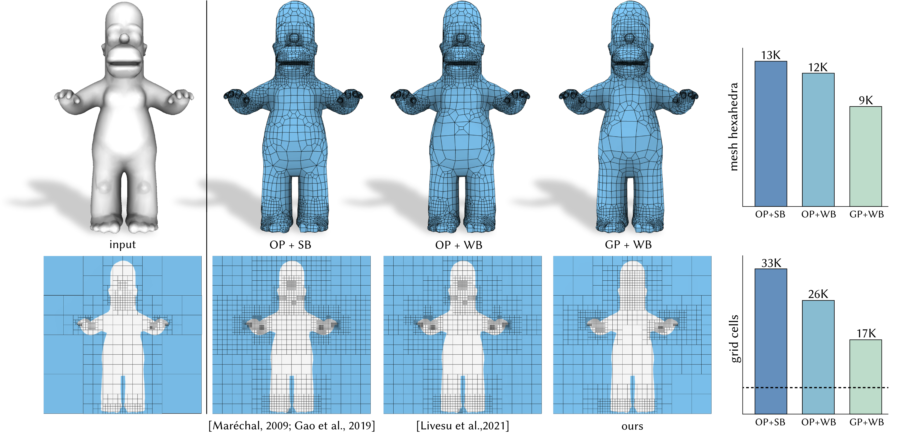

# Generalized Adaptive Refinement for Grid-based Hexahedral Meshing

This is the code we used for the experiments in the paper "**Generalized Adaptive Refinement for Grid-based Hexahedral Meshing**" by [L. Pitzalis](https://pizza1994.github.io), [M. Livesu](http://pers.ge.imati.cnr.it/livesu/), [G. Cherchi](http://www.gianmarcocherchi.com), [E. Gobbetti](https://www.crs4.it/it/peopledetails/8/enrico-gobbetti/) and [R. Scateni](https://people.unica.it/riccardoscateni/) (ACM TOG, SIGGRAPH Asia 2021). 

_**New**: Try our [**Online Demo**](http://90.147.146.248)!_ 😊

<p align="center"></p>

## Dependencies
This project is built on top of some external libraries. Make sure to have them installed on your machine before proceeding with the building process. In addition to [Cinolib](https://github.com/mlivesu/cinolib.git), which is already a submodule of this repository, it is necessary to install [Gurobi](https://www.gurobi.com) for ILP resolution and [CGAL](https://www.cgal.org) for the computation of the Shape Diameter Function (SDF). Follow the instructions at this [link](https://www.gurobi.com/documentation/6.5/quickstart_linux/software_installation_guid.html) to install Gurobi and run the following command to install CGAL:
#### MacOS
```
brew install cgal
```
#### Linux
```
sudo apt-get install libcgal-dev
```
|:warning: WARNING: FindGUROBI.cmake is configured to search for gurobi 9.1.x versions. Please edit the "gurobi91" entry in FindGUROBI.cmake if you have a different gurobi version installed on your machine|
| --- |
## Building
Clone this repository, including submodules, with:
```
git clone --recursive https://github.com/cg3hci/Gen-Adapt-Ref-for-Hexmeshing.git
```
Build the executable by running the following commands:
```
cd Gen-Adapt-Ref-for-Hexmeshing 
mkdir build
cd build
cmake -DCMAKE_BUILD_TYPE=<build type> ..
make
```

## Usage

You can generate a paired and balanced grid starting from a triangle mesh by running the following command:
```
./make_grid --surface --input_mesh_path=your_input_mesh.obj --output_grid_path=grid.mesh
```
Look at the available customizable options with:
```
./make_grid --help
```

## Citing us
If you use our code in your academic projects, please cite our paper using the following BibTeX entry:
```
@article{PLCSG21,
  title   = {Generalized Adaptive Refinement for Grid-based Hexahedral Meshing},
  author  = {Pitzalis, Luca and Livesu, Marco and Cherchi, Gianmarco and Scateni, Riccardo and Gobbetti, Enrico},
  journal = {ACM Transactions on Graphics (SIGGRAPH Asia 2021)},
  year    = {2021},
  volume  = {40},
  number  = {6},
  doi     = {https://doi.org/10.1145/3478513.3480508}
}
```
